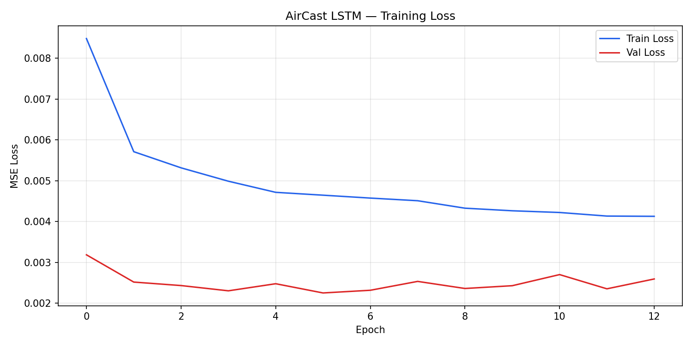

# 🌬️ AirCast — Real-Time Air Quality Forecasting System

> Real-time PM2.5, PM10, and NO2 monitoring + 24-hour LSTM forecast for 5 Indian cities.

[](https://aircast-tlfzsuquztj22vrp44egu7.streamlit.app/)
[](https://github.com/Ashu07017/airCAST)


---

## 🔴 Live Demo

**[aircast-tlfzsuquztj22vrp44egu7.streamlit.app](https://aircast-tlfzsuquztj22vrp44egu7.streamlit.app/)**

- Select any of 5 Indian cities from the sidebar
- View real-time PM2.5, PM10, NO2 readings with AQI category
- See 48-hour historical pollution trend chart
- Get 24-hour PM2.5 forecast from trained LSTM model

---

## 📊 Model Performance

| Metric | Value |
|--------|-------|
| MAE (Mean Absolute Error) | **4.63 µg/m³** |
| RMSE (Root Mean Square Error) | **6.39 µg/m³** |
| Training data | 90 days × 5 cities × 24hr |
| Total sequences | 10,685 |
| Model parameters | 52,504 |

*Evaluated on held-out chronological test set (last 15% of data). WHO daily safe limit = 15 µg/m³.*

---

## 🏗️ Architecture

```
Open-Meteo API (hourly)
        ↓
GitHub Actions cron (every hour)
        ↓
fetch_data.py → data/raw/YYYY-MM-DD.csv
        ↓
preprocess.py → sliding window sequences (24hr input → 24hr output)
        ↓
AirCastLSTM (2-layer PyTorch LSTM, hidden=64, dropout=0.2)
        ↓
Streamlit Dashboard → Live deployed on Streamlit Cloud
```

---

## 🗂️ Project Structure

```
airCAST/
├── .github/
│   └── workflows/
│       └── fetch.yml          # hourly GitHub Actions cron
├── data/
│   └── raw/                   # daily CSVs committed automatically
├── models/
│   ├── aircast_lstm.pt        # trained model weights
│   └── scaler.pkl             # fitted MinMaxScaler
├── results/
│   ├── training_loss.png      # train vs val loss curve
│   └── eval_metrics.txt       # MAE, RMSE on test set
├── src/
│   ├── fetch_data.py          # Open-Meteo API data pipeline
│   ├── preprocess.py          # data cleaning + sequence creation
│   ├── model.py               # PyTorch LSTM architecture
│   └── train.py               # training loop + evaluation
├── app.py                     # Streamlit dashboard
└── requirements.txt
```

---

## ⚙️ Tech Stack

| Component | Technology |
|-----------|------------|
| Language | Python 3.12 |
| ML Framework | PyTorch 2.2 |
| Data Processing | Pandas, NumPy, Scikit-learn |
| Dashboard | Streamlit |
| Data Source | Open-Meteo Air Quality API (free) |
| Automation | GitHub Actions (cron schedule) |
| Deployment | Streamlit Cloud |

---

## 🚀 Run Locally

```bash
# 1. Clone the repo
git clone https://github.com/Ashu07017/airCAST.git
cd airCAST

# 2. Create virtual environment with Python 3.12
py -3.12 -m venv .venv
.venv\Scripts\activate        # Windows
# source .venv/bin/activate   # Mac/Linux

# 3. Install dependencies
pip install -r requirements.txt

# 4. Collect historical data (run once)
python src/fetch_data.py --backfill

# 5. Train the model (optional — weights already included)
python src/train.py

# 6. Launch the dashboard
streamlit run app.py
```

---

## 📈 Training Loss



*Early stopping triggered at epoch 13 — validation loss stopped improving.*

---

## 🏙️ Cities Covered

| City | Coordinates |
|------|-------------|
| Delhi | 28.61°N, 77.21°E |
| Mumbai | 19.08°N, 72.88°E |
| Bengaluru | 12.97°N, 77.59°E |
| Chennai | 13.08°N, 80.27°E |
| Kolkata | 22.57°N, 88.36°E |

---

## 👤 Built By

**Ashok Chaturvedi**
B.E. Computer Science (AI/ML) — Chandigarh University
[GitHub](https://github.com/Ashu07017) · [LinkedIn](https://www.linkedin.com/in/ashok-chaturvedi-6745a6288)